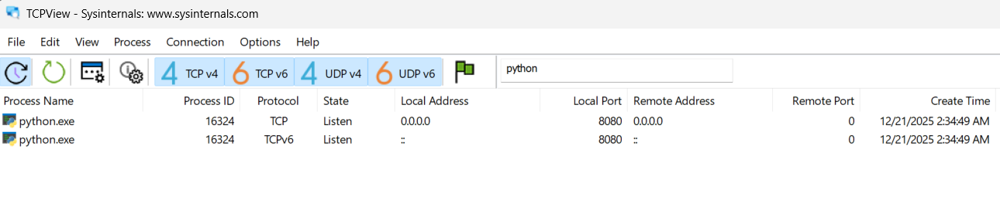

# Network Traffic Analysis & Firewall Access Control

**Role:** Network Administrator
**Tools:** Sysinternals TCPView, Windows Defender Firewall, Python (Simulated Threat)
**Focus:** Port Security, Attack Surface Reduction, Access Control Lists (ACLs)

---

##  Executive Summary
My organization requires strict control over network traffic to prevent unauthorized access. This project documents the audit of active network endpoints and the implementation of strict **Access Control Lists (ACLs)** to harden the network perimeter.

Using **Sysinternals TCPView**, I identified an unauthorized "Shadow IT" web server listening on an open port. I effectively neutralized the risk by configuring **Windows Defender Firewall** to block ingress traffic without disrupting system stability.

---

## 1. Network Endpoint Audit (Threat Identification)
To secure the network, I first visualized which processes were actively communicating or waiting for connections to identify potential entry points.

### Action
I deployed **Sysinternals TCPView** to map active TCP/UDP endpoints. I filtered the real-time stream to identify processes in a `LISTENING` state on non-standard ports.

### Findings
* **Anomaly Detected:** A `python.exe` process was found listening on **TCP Port 8080**.
* **Risk Assessment:** The service was active and capable of accepting external connections from mobile clients, representing an unmanaged security risk (Shadow IT).

*Figure 1: TCPView dashboard revealing the unauthorized Python web server on Port 8080.*

---

## 2. Remediation: Firewall Access Control
After identifying the unauthorized service, I needed to isolate it immediately. Instead of terminating the application—which might cause instability—I chose to block the network traffic at the host layer.

### Action
I configured a **Windows Defender Firewall Inbound Rule** to strictly deny ingress traffic to the vulnerable port.

* **Rule Type:** Custom Port Rule (TCP 8080)
* **Action:** Block the connection
* **Scope:** All Network Profiles (Domain, Private, Public)

*Figure 2: Configuring the Inbound Rule to drop all packets directed at Port 8080.*

---

## 3. Verification & Results
To validate the security controls, I conducted a connectivity test from an external client.

* **Pre-Hardening:** The web server was accessible via browser on Port 8080.
* **Post-Hardening:** Connection requests timed out immediately.
* **Outcome:** The service was successfully isolated from the network, reducing the attack surface to zero while maintaining system uptime.

---

## 4. Key Skills Demonstrated
* **Network Forensics:** Mapping active sockets and processes using TCPView.
* **System Hardening:** Reducing attack surface by closing unused or risky ports.
* **Access Control:** Implementing "Deny by Default" principles using Host-Based Firewalls.
